# Destaker — AI-Powered Yield Prediction Markets

> **Sybil-resistant prediction markets for DeFi yields, powered by World ID verification and real-time AI predictions.**

   

---

## 🏗️ Product Introduction

Destaker is a **decentralized prediction market platform** focused on DeFi yield outcomes. Users can trade YES/NO positions on whether specific yield assets (ETH LSDs, SOL LSDs, restaking protocols, DeFi yield pools) will exceed target APY thresholds by settlement dates.

**Key Features:**
- 🔮 **12 Live Markets** across ETH LSDs (stETH, rETH, cbETH, sfrxETH), SOL LSDs (mSOL, jitoSOL, bSOL), Restaking (EigenLayer), and DeFi Yield (Aave V3, Lido, Compound, Pendle PT)
- 🤖 **AI-Powered Predictions** using Gemini AI analyzing real-time DeFiLlama data
- 🌐 **World ID Verification** for Sybil-resistant trading (Cloud + On-Chain ready)
- 📊 **Live Data** from 1,800+ DeFi pools via DeFiLlama API
- 💹 **Dynamic YES/NO Pricing** driven by AI probability scores

---

## 🔴 The Problem

DeFi yield markets suffer from three critical issues:

1. **Sybil Attacks** — Prediction markets are vulnerable to users creating multiple accounts to manipulate outcomes
2. **Information Asymmetry** — Retail traders lack access to sophisticated yield forecasting tools
3. **Static Pricing** — Traditional prediction markets use AMM-based pricing that doesn't incorporate real-time yield data

---

## ✅ The Solution

Destaker solves these problems through:

| Problem | Solution | Technology |
|---------|----------|-----------|
| Sybil Attacks | World ID human verification | `@worldcoin/idkit` v4 + Cloud verification API |
| Information Asymmetry | AI yield predictions with full transparency | Gemini 2.5 Flash Lite + DeFiLlama real-time data |
| Static Pricing | Dynamic pricing from AI probability scores | Live pool analysis → YES/NO price computation |

---

## ⚙️ How It Works

### Architecture Overview


### Frontend Architecture


### Backend Architecture


---

## 🌐 World ID Integration

### Overview

World ID provides **Sybil-resistant identity verification** ensuring each trader is a unique human. Destaker implements both **Cloud (Off-Chain)** and is **On-Chain ready**.

### How It Works

```mermaid
sequenceDiagram
    participant U as User
    participant FE as Frontend (IDKit v4)
    participant RP as RP Context Function
    participant WA as World App
    participant VF as Verify Function
    participant WC as World ID Cloud API

    U->>FE: Click "Verify with World ID"
    FE->>RP: Request RP context
    RP-->>FE: {rp_id, nonce, signature, expires_at}
    FE->>WA: Open IDKit widget (QR code)
    WA-->>FE: Proof {merkle_root, nullifier_hash, proof}
    FE->>VF: Send proof for verification
    VF->>WC: POST /api/v2/verify/{app_id}
    WC-->>VF: {success: true}
    VF-->>FE: {verified: true, verification_level}
    FE->>U: ✅ Verified Human badge
```



### World ID Code Files

| File | Purpose | World ID Function |
|------|---------|-------------------|
| `src/components/WorldIDVerify.tsx` | 🌐 **World ID** — IDKit v4 React widget integration | Renders verification button, handles proof callback, sends to cloud verification |
| `supabase/functions/verify-worldid/index.ts` | 🌐 **World ID** — Cloud proof verification | Receives proof → calls World ID API → returns verification status |
| `supabase/functions/worldid-rp-context/index.ts` | 🌐 **World ID** — RP context generation | Generates signed nonce + timestamps for IDKit v4 widget |
| `src/contexts/AuthContext.tsx` | 🌐 **World ID** — Auth state management | Stores wallet + verification state (level, nullifier hash) |
| `src/components/ConnectWalletModal.tsx` | 🌐 **World ID** — Verification modal | Two-step flow: Connect Wallet → Verify with World ID |

### Verification Levels
- **Device** — Lower friction, device-based verification
- **Orb** — Higher trust, biometric Orb verification
- Both levels unlock trading access

### Key Configuration
- **App ID**: `app_135f61bfd908558b3c07fd6580d58192`
- **Action**: `destaker-verify`
- **Cloud API**: `https://developer.worldcoin.org/api/v2/verify/`
- **IDKit Version**: `@worldcoin/idkit` v4.0.1

---

## 🤖 AI Prediction Engine

### How AI Predictions Work

1. **Data Collection**: Fetches live yield data from DeFiLlama (18,000+ pools)
2. **Analysis**: Filters to relevant pools, extracts APY, 30-day mean APY, TVL
3. **AI Reasoning**: Gemini 2.5 Flash Lite analyzes yield trends, market conditions
4. **Output**: Structured prediction with confidence score, probability, reasoning, risk factors

### AI Code Files

| File | Purpose | Technology |
|------|---------|-----------|
| `supabase/functions/predict-yield/index.ts` | 🤖 **AI** — Single market prediction engine | Gemini AI + DeFiLlama API |
| `supabase/functions/batch-predict/index.ts` | 🤖 **AI** — Batch prediction for all markets | Parallel Gemini AI calls |
| `src/components/AIPredictionPanel.tsx` | 🤖 **AI** — Prediction display component | Shows confidence, reasoning, risk factors |
| `src/hooks/usePredictions.ts` | 🤖 **AI** — Prediction data hooks | Fetches/triggers predictions |

---

## 📊 Data Sources & APIs

### Real-Time APIs Used

| API | Purpose | Endpoint |
|-----|---------|----------|
| **DeFiLlama Yields** | Live APY data for 18,000+ pools | `https://yields.llama.fi/pools` |
| **World ID Cloud** | Human verification | `https://developer.worldcoin.org/api/v2/verify/` |
| **Gemini AI** | Yield predictions | Lovable AI Gateway |

### Data Code Files

| File | Purpose |
|------|---------|
| `supabase/functions/fetch-yields/index.ts` | 📊 **Data** — DeFiLlama pool fetcher, filters & stores 1,859 pools |
| `src/hooks/useYieldPools.ts` | 📊 **Data** — React hook for yield pool data |
| `src/hooks/useRealMarkets.ts` | 📊 **Data** — Combines pools + predictions into market prices |

---

## 📁 Repository Structure

### File Index with Labels

```
src/
├── components/
│   ├── WorldIDVerify.tsx        # 🌐 World ID — IDKit v4 widget
│   ├── ConnectWalletModal.tsx   # 🌐 World ID — Wallet + verify flow
│   ├── UserMenu.tsx             # 🌐 World ID — Navbar auth status
│   ├── AIPredictionPanel.tsx    # 🤖 AI — Prediction display
│   ├── MarketCard.tsx           # 📊 Data — Market card with live prices
│   ├── HeroMarket.tsx           # 📊 Data — Featured market banner
│   ├── StatCard.tsx             # UI — Stat display component
│   ├── NavLink.tsx              # UI — Navigation link
│   └── Navbar.tsx               # UI — Top navigation bar
├── contexts/
│   └── AuthContext.tsx           # 🌐 World ID — Global auth state
├── hooks/
│   ├── useRealMarkets.ts        # 📊 Data — Live market computation
│   ├── useYieldPools.ts         # 📊 Data — DeFiLlama pool data
│   └── usePredictions.ts        # 🤖 AI — Prediction hooks
├── pages/
│   ├── Index.tsx                 # Markets homepage
│   ├── MarketDetail.tsx          # Trading + AI prediction page
│   ├── Portfolio.tsx             # User portfolio
│   └── NotFound.tsx              # 404 page
└── lib/
    └── mockData.ts               # Market type definitions

supabase/functions/
├── verify-worldid/index.ts       # 🌐 World ID — Cloud verification
├── worldid-rp-context/index.ts   # 🌐 World ID — RP context generator
├── predict-yield/index.ts        # 🤖 AI — Single market AI prediction
├── batch-predict/index.ts        # 🤖 AI — Batch AI predictions
└── fetch-yields/index.ts         # 📊 Data — DeFiLlama data fetcher
```

---

## ✅ Evidence of Working System

### Backend Verification

**1. DeFiLlama Data Fetch** — Successfully fetches and stores 1,859 pools from 18,063 total:
```
Fetching pools from DeFiLlama...
Received 18063 total pools from DeFiLlama
Filtered to 1859 relevant pools
Upserted 1859 pools ✅
```

**2. AI Predictions** — Gemini AI generates structured predictions with live data:
```json
{
  "prediction": {
    "predicted_apy": 2.35,
    "current_apy": 2.3,
    "confidence": 0.72,
    "probability_above_threshold": 0.06,
    "prediction_direction": "below",
    "reasoning": "stETH staking yield currently sits at 2.3%, well below the 3.5% threshold..."
  },
  "evidence": {
    "defillama_pools_analyzed": 15,
    "primary_pool": { "project": "lido", "chain": "Ethereum", "tvl_usd": 18700000000 }
  }
}
```

**3. World ID Cloud Verification** — Backend correctly validates proofs:
```json
// Valid proof → 200 OK
{ "verified": true, "nullifier_hash": "0x...", "verification_level": "device" }

// Invalid proof → 400 Bad Request  
{ "verified": false, "error": "validation_error", "detail": "Invalid nullifier_hash" }
```

**4. RP Context Generation** — Generates signed contexts for IDKit v4:
```json
{
  "rp_context": {
    "rp_id": "rp_destaker_demo",
    "nonce": "4163e7a8-7fe2-40e3-b457-e19dd2eacb53",
    "created_at": 1771768247,
    "expires_at": 1771771847,
    "signature": "fe50a6a165d38e73c3d7284a0413c81f..."
  }
}
```

### Frontend Verification

- ✅ 12 markets display with real-time YES/NO prices from AI predictions
- ✅ Live DeFiLlama data (1,000+ pools tracked indicator)
- ✅ Connect Wallet flow works (MetaMask/WalletConnect simulation)
- ✅ World ID "Verify with World ID" button triggers IDKit v4 widget
- ✅ RP context fetched from backend before widget opens
- ✅ Wallet + verification state persisted in React context
- ✅ Trading panel gates behind wallet connection + World ID verification
- ✅ AI Prediction Panel shows confidence, reasoning, risk factors
- ✅ Batch prediction runs all 12 markets in parallel

---

## 🛠️ Tech Stack

| Layer | Technology |
|-------|-----------|
| Frontend | React 18, TypeScript, Vite, Tailwind CSS, Framer Motion |
| UI Components | shadcn/ui (Radix primitives) |
| State | React Context, TanStack Query |
| Identity | World ID IDKit v4, Cloud Verification API |
| AI | Gemini 2.5 Flash Lite (via Lovable AI Gateway) |
| Data | DeFiLlama Yields API (18,000+ pools) |
| Backend | Edge Functions (Deno) |
| Database | PostgreSQL with RLS policies |
| Deployment | Lovable Cloud |

---

## 🚀 Getting Started

```sh
# Clone the repository
git clone <YOUR_GIT_URL>

# Navigate to the project directory
cd destaker

# Install dependencies
npm install

# Start the development server
npm run dev
```

### Environment Variables

The project uses Lovable Cloud for backend infrastructure. Environment variables are automatically configured:

- `VITE_SUPABASE_URL` — Backend API URL
- `VITE_SUPABASE_PUBLISHABLE_KEY` — Public API key
- `VITE_SUPABASE_PROJECT_ID` — Project identifier

### World ID Setup

1. Create a World ID app at [developer.worldcoin.org](https://developer.worldcoin.org)
2. Set your App ID in `src/components/WorldIDVerify.tsx` and `supabase/functions/verify-worldid/index.ts`
3. Configure the action name (`destaker-verify`)

---

## 📜 CRE Workflow Capability

### Can Destaker integrate a CRE Workflow?

**Yes.** Destaker's architecture is designed as an orchestration layer that integrates:

1. **Blockchain** — World ID on-chain verification (Ethereum smart contracts via `WorldIDVerifier.sol`)
2. **External APIs** — DeFiLlama yields API for real-time pool data
3. **AI Agent** — Gemini AI for yield prediction and market analysis
4. **Data Source** — PostgreSQL database for predictions and market resolutions

A CRE Workflow would orchestrate:
```
Trigger (settlement date) 
  → Fetch live APY from DeFiLlama (external API)
  → Run AI prediction (LLM agent)  
  → Compare against threshold (business logic)
  → Submit resolution on-chain (blockchain)
  → Distribute payouts (smart contract)
```

This workflow can be simulated via CRE CLI or deployed on the CRE network, with each step producing verifiable outputs stored in the database.

---

## 📄 License

MIT License — Built for the World ID hackathon.
